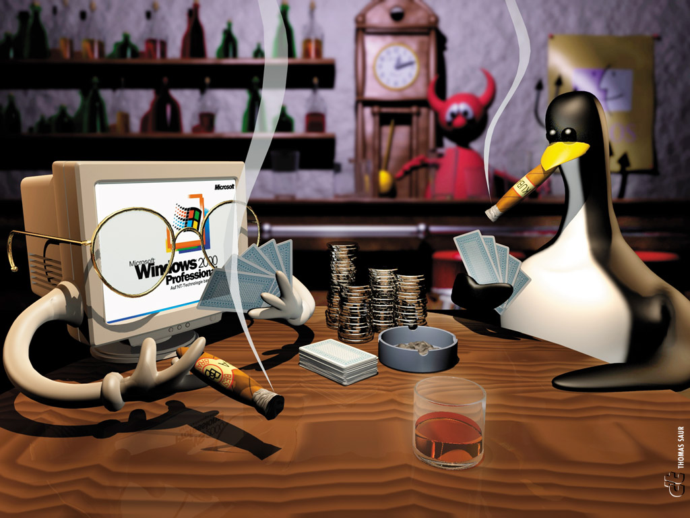

    
     
    
     
    
    
     
    <table>
  <tr>
    <td>
      
    </td>
    <td>
      

            <strong>
                About me:
            </strong>
        

      

        Hello, my name is Henry Kauã. I'm a Brazilian Software Engineering student, currently in my final year of a Systems Analysis and Development degree.
      

       
    </td>
  </tr>
</table>

    <h4>Technologies and tools</h4>
    
    
    
    
    
    
    
    
    
    
    

    <h4>Socials</h4>
    
    
    
     

